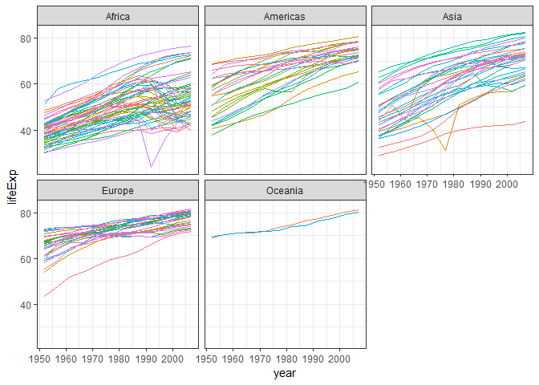
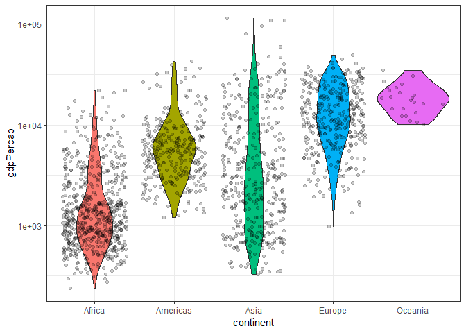
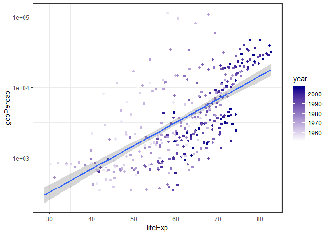

hw02\_gapminder
================

Homework 02: Explore Gapminder and use dplyr
============================================

Bring rectangular data in
-------------------------

``` r
library(gapminder)
library(tidyverse)
```

    ## -- Attaching packages ------------------------------------------------------------ tidyverse 1.2.1 --

    ## v ggplot2 3.0.0     v purrr   0.2.5
    ## v tibble  1.4.2     v dplyr   0.7.6
    ## v tidyr   0.8.1     v stringr 1.3.1
    ## v readr   1.1.1     v forcats 0.3.0

    ## -- Conflicts --------------------------------------------------------------- tidyverse_conflicts() --
    ## x dplyr::filter() masks stats::filter()
    ## x dplyr::lag()    masks stats::lag()

Smell test the data
-------------------

Explore the `gapminder` object:

-   Is it a data.frame, a matrix, a vector, a list?
-   What is its class?
-   How many variables/columns?
-   How many rows/observations?

``` r
str(gapminder)
```

    ## Classes 'tbl_df', 'tbl' and 'data.frame':    1704 obs. of  6 variables:
    ##  $ country  : Factor w/ 142 levels "Afghanistan",..: 1 1 1 1 1 1 1 1 1 1 ...
    ##  $ continent: Factor w/ 5 levels "Africa","Americas",..: 3 3 3 3 3 3 3 3 3 3 ...
    ##  $ year     : int  1952 1957 1962 1967 1972 1977 1982 1987 1992 1997 ...
    ##  $ lifeExp  : num  28.8 30.3 32 34 36.1 ...
    ##  $ pop      : int  8425333 9240934 10267083 11537966 13079460 14880372 12881816 13867957 16317921 22227415 ...
    ##  $ gdpPercap: num  779 821 853 836 740 ...

*The output shows that the gapminder is a data frame (Classes are ‘tbl\_df’, ‘tbl’ and 'data.frame'). There are 6 columns/variables and 1704 rows/observations.*

-   Can you get these facts about "extent" or "size" in more than one way? Can you imagine different functions being useful in different contexts?

``` r
nrow(gapminder)
```

    ## [1] 1704

``` r
ncol(gapminder)
```

    ## [1] 6

*Using `ncol` and `nrow` is another way to get these dimensions. While `str` gives us more information, these 2 can be useful, especially if you want to use just the number of rows/cols. One might do so to calculate mean or loop through columns.*

-   What data type is each variable?

From `str`, we can see the type for each variable.

-   country is Factor
-   continent is Factor
-   year is int
-   lifeExp is num
-   pop is int
-   gdpPercap is num

Explore individual variables
----------------------------

Pick **at least** one categorical variable and at least one quantitative variable to explore.

-   What are possible values (or range, whichever is appropriate) of each variable?
-   What values are typical? What's the spread? What's the distribution? Etc., tailored to the variable at hand.
-   Feel free to use summary stats, tables, figures. We're NOT expecting high production value (yet).

*We can see a summary with of all the variable using `summary`.*

``` r
summary(gapminder)
```

    ##         country        continent        year         lifeExp     
    ##  Afghanistan:  12   Africa  :624   Min.   :1952   Min.   :23.60  
    ##  Albania    :  12   Americas:300   1st Qu.:1966   1st Qu.:48.20  
    ##  Algeria    :  12   Asia    :396   Median :1980   Median :60.71  
    ##  Angola     :  12   Europe  :360   Mean   :1980   Mean   :59.47  
    ##  Argentina  :  12   Oceania : 24   3rd Qu.:1993   3rd Qu.:70.85  
    ##  Australia  :  12                  Max.   :2007   Max.   :82.60  
    ##  (Other)    :1632                                                
    ##       pop              gdpPercap       
    ##  Min.   :6.001e+04   Min.   :   241.2  
    ##  1st Qu.:2.794e+06   1st Qu.:  1202.1  
    ##  Median :7.024e+06   Median :  3531.8  
    ##  Mean   :2.960e+07   Mean   :  7215.3  
    ##  3rd Qu.:1.959e+07   3rd Qu.:  9325.5  
    ##  Max.   :1.319e+09   Max.   :113523.1  
    ## 

*I have chosen to explore gdpPercap and continent*

### Exploring "gdpPercap"

*I can see a summary of gdpPercap specifically that contains its min, max, mean, median, 1st quartile and 3rd quartile.*

``` r
summary(gapminder$gdpPercap)
```

    ##     Min.  1st Qu.   Median     Mean  3rd Qu.     Max. 
    ##    241.2   1202.1   3531.8   7215.3   9325.5 113523.1

*Alternatively, I can calculate several of these individually.*

``` r
min(gapminder$gdpPercap)
```

    ## [1] 241.1659

``` r
max(gapminder$gdpPercap)
```

    ## [1] 113523.1

``` r
mean(gapminder$gdpPercap)
```

    ## [1] 7215.327

``` r
median(gapminder$gdpPercap)
```

    ## [1] 3531.847

*I can get a sense of the distribution of the data by looking at its variance or standard deviation.*

``` r
var(gapminder$gdpPercap)
```

    ## [1] 97169410

``` r
sd(gapminder$gdpPercap)
```

    ## [1] 9857.455

### Exploring "continent"

*Since continent is a factor, let's look at its levels.*

``` r
levels(gapminder$continent)
```

    ## [1] "Africa"   "Americas" "Asia"     "Europe"   "Oceania"

*There are 5 different levels. We can count them with `summary` as well to see how many of the data points fall in each continent.*

``` r
summary(gapminder$continent)
```

    ##   Africa Americas     Asia   Europe  Oceania 
    ##      624      300      396      360       24

Explore various plot types
--------------------------

Make a few plots, probably of the same variable you chose to characterize numerically. You can use the plot types we went over in class (cm006) to get an idea of what you'd like to make. Try to explore more than one plot type. **Just as an example** of what I mean:

-   A scatterplot of two quantitative variables.
-   A plot of one quantitative variable. Maybe a histogram or densityplot or frequency polygon.
-   A plot of one quantitative variable and one categorical. Maybe boxplots for several continents or countries.

You don't have to use all the data in every plot! It's fine to filter down to one country or small handful of countries.

Use `filter()`, `select()` and `%>%`
------------------------------------

Use `filter()` to create data subsets that you want to plot.

Practice piping together `filter()` and `select()`. Possibly even piping into `ggplot()`.

Alvin's Exploration Plots
-------------------------

### Life Expectancy and Years

``` r
gapminder %>%
  ggplot(aes(x = year, y = lifeExp, color = country)) +
  geom_line(lwd = 0.5, show.legend = FALSE) + 
  facet_wrap(~ continent) +
  theme_bw()
```



*Here, I plot the lifeExp of each country as a different colour of the years. Over time, life expenctancy increases. I decided to pipe in the gapminder dataset with `%>%`. Additional things I did were to hide the legend, change the line width, change to bw theme, and facet by the different continents.*

### GDP per Capita and continent

``` r
ggplot(gapminder, aes(x = continent, y = gdpPercap)) +
  scale_y_log10() +
  theme_bw() +
  geom_violin(aes(fill = continent), show.legend = FALSE) +
  geom_jitter(alpha = 0.2)
```



*Now, I want to look at the distrubition of GDP per capita for each continent. There is a violin plot, with different fill for each continent. Overlaid is a jitter plot for each point to better visualize distributaion. I've chosen a log Y scale for the GDP per cap. We can see the African countries are amongst the poorest. However, there is a skew, with a few rather wealthier African countries. Given the log scale, this highlights great disparity. Simila observation with Asian countries, showing a wide spread.*

Life Expectancy and GDP per capita
----------------------------------

``` r
gapminder %>%
  filter(continent == "Asia") %>%
  ggplot(aes(x = lifeExp, y = gdpPercap, colour = year)) +
  geom_point() +
  scale_y_log10() +
  theme_bw() +
  geom_smooth(method = "lm") +
  scale_colour_gradient(low = "white", high = "darkblue")
```



*This time, I `filter` for Asian countries. I look at the relationship between lifeExp and gdpPercap, which is a postive trend (demonstrated with the geom\_smooth). The GDP is on a log Y scale again. Additionally, I coloured the points, by year. We can see that the more recent years have a tread of higher lifeExp and higher GDP.*

But I want to do more!
----------------------

### More with `dplyr`

I want to demonstrate the `mutate` function.

``` r
gapminder %>%
  select(country, year, pop, gdpPercap) %>%
  mutate(GDP = pop * gdpPercap)
```

    ## # A tibble: 1,704 x 5
    ##    country      year      pop gdpPercap          GDP
    ##    <fct>       <int>    <int>     <dbl>        <dbl>
    ##  1 Afghanistan  1952  8425333      779.  6567086330.
    ##  2 Afghanistan  1957  9240934      821.  7585448670.
    ##  3 Afghanistan  1962 10267083      853.  8758855797.
    ##  4 Afghanistan  1967 11537966      836.  9648014150.
    ##  5 Afghanistan  1972 13079460      740.  9678553274.
    ##  6 Afghanistan  1977 14880372      786. 11697659231.
    ##  7 Afghanistan  1982 12881816      978. 12598563401.
    ##  8 Afghanistan  1987 13867957      852. 11820990309.
    ##  9 Afghanistan  1992 16317921      649. 10595901589.
    ## 10 Afghanistan  1997 22227415      635. 14121995875.
    ## # ... with 1,694 more rows

*First, I take gapminder and using pipes, I select for a few relevant columns. GDP per capita is GDP divided by population. I want a new column with GDP. Using `dplyr::mutate`, I make a new column, GDP, which is the total pop X gdpPercap.*

### Even more

*For people who want to take things further.*

Evaluate this code and describe the result. Presumably the analyst's intent was to get the data for Rwanda and Afghanistan. Did they succeed? Why or why not? If not, what is the correct way to do this?

``` r
filter(gapminder, country == c("Rwanda", "Afghanistan"))
```

    ## # A tibble: 12 x 6
    ##    country     continent  year lifeExp      pop gdpPercap
    ##    <fct>       <fct>     <int>   <dbl>    <int>     <dbl>
    ##  1 Afghanistan Asia       1957    30.3  9240934      821.
    ##  2 Afghanistan Asia       1967    34.0 11537966      836.
    ##  3 Afghanistan Asia       1977    38.4 14880372      786.
    ##  4 Afghanistan Asia       1987    40.8 13867957      852.
    ##  5 Afghanistan Asia       1997    41.8 22227415      635.
    ##  6 Afghanistan Asia       2007    43.8 31889923      975.
    ##  7 Rwanda      Africa     1952    40    2534927      493.
    ##  8 Rwanda      Africa     1962    43    3051242      597.
    ##  9 Rwanda      Africa     1972    44.6  3992121      591.
    ## 10 Rwanda      Africa     1982    46.2  5507565      882.
    ## 11 Rwanda      Africa     1992    23.6  7290203      737.
    ## 12 Rwanda      Africa     2002    43.4  7852401      786.

This is not correct. Note there is missing data.

``` r
filter(gapminder, country %in% c("Rwanda", "Afghanistan"))
```

    ## # A tibble: 24 x 6
    ##    country     continent  year lifeExp      pop gdpPercap
    ##    <fct>       <fct>     <int>   <dbl>    <int>     <dbl>
    ##  1 Afghanistan Asia       1952    28.8  8425333      779.
    ##  2 Afghanistan Asia       1957    30.3  9240934      821.
    ##  3 Afghanistan Asia       1962    32.0 10267083      853.
    ##  4 Afghanistan Asia       1967    34.0 11537966      836.
    ##  5 Afghanistan Asia       1972    36.1 13079460      740.
    ##  6 Afghanistan Asia       1977    38.4 14880372      786.
    ##  7 Afghanistan Asia       1982    39.9 12881816      978.
    ##  8 Afghanistan Asia       1987    40.8 13867957      852.
    ##  9 Afghanistan Asia       1992    41.7 16317921      649.
    ## 10 Afghanistan Asia       1997    41.8 22227415      635.
    ## # ... with 14 more rows

``` r
filter(gapminder, country == "Rwanda" | country == "Afghanistan")
```

    ## # A tibble: 24 x 6
    ##    country     continent  year lifeExp      pop gdpPercap
    ##    <fct>       <fct>     <int>   <dbl>    <int>     <dbl>
    ##  1 Afghanistan Asia       1952    28.8  8425333      779.
    ##  2 Afghanistan Asia       1957    30.3  9240934      821.
    ##  3 Afghanistan Asia       1962    32.0 10267083      853.
    ##  4 Afghanistan Asia       1967    34.0 11537966      836.
    ##  5 Afghanistan Asia       1972    36.1 13079460      740.
    ##  6 Afghanistan Asia       1977    38.4 14880372      786.
    ##  7 Afghanistan Asia       1982    39.9 12881816      978.
    ##  8 Afghanistan Asia       1987    40.8 13867957      852.
    ##  9 Afghanistan Asia       1992    41.7 16317921      649.
    ## 10 Afghanistan Asia       1997    41.8 22227415      635.
    ## # ... with 14 more rows

Here are 2 possible solution. One uses `|` as an OR statement. The other uses `%in%`.
